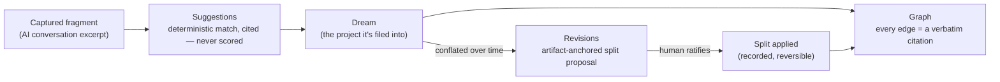

# Architecture

Dreamcatcher's cockpit rests on two disciplines that would matter immediately to anyone who's used a
linked-notes or PKM tool before: **honesty** (nothing is asserted that production can't actually do,
and nothing real is understated either) and **coherence** (the whole fixture dataset stays internally
consistent relative to *today*, not frozen to whenever it was written). A demo that shows a fabricated
confidence score, or whose "3 days ago" label reads as three months stale a month after launch, is
exactly what makes a knowledge tool read as fake — so neither happens here.

## The capture → organize → trace → cite flow

A fragment is captured from an AI conversation, filed into a dream (a project), and — because early
fragments are often conflated before their real shape is clear — can later be **retro-traced** apart
and its relationships **cited**, never guessed.



## Why nothing is scored

Suggestions never render a confidence percentage, and Graph edges are never drawn from similarity or
co-occurrence — both are deterministic, citation-backed operations in production, so the demo mirrors
that honestly instead of inventing an ML score for effect. A grep-gate enforces this at every release:

```bash
grep -rnE '[0-9]{1,3}\s*%[\s-]*(confidence|confident|accuracy|accurate|match|certainty|certain)|confidence:\s*0?\.[0-9]' src
# must return 0 hits
```

## The anchor-relative fixture model

Every fixture date passes through `shiftIso()` (`src/field-notebook/dates.js`), which re-bases the
entire dataset onto today relative to a fixed original anchor (`2026-05-22`). Edit fixture literals as
if the anchor were still in place — relative ages, timelines, and analytics buckets stay internally
consistent automatically, and the demo never goes stale the way a build with frozen absolute dates
would. The anchor-coherence unit gate (`npm run test:unit`) asserts this derives from `Date.now()` at
runtime, not a value baked in at build time.

## Rail / route model

`FieldNotebookApp.jsx` renders a screen from a `route.kind` string switch; `Rail.jsx` is the nav.
Adding a screen is a Rail entry + a `route.kind` branch + a view component + fixtures — this is how
Revisions and Graph (the two signature workflows) were added without disturbing the existing screens.
